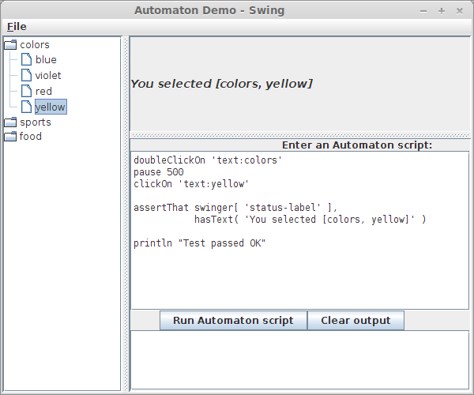
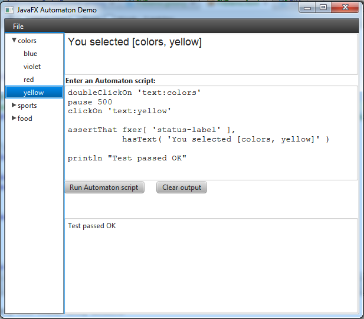

# Automaton
* easy tests for Swing and JavaFX applications
* written for testers. Only basic coding skills required.

Automaton is a framework which makes it easy to test Java GUIs developed with Swing, JavaFX 2, or both.

If you need to thoroughly test a Swing/JavaFX UI or simply automate a UI task, Automaton can help you.

You can choose how you use Automaton:

  * write simple, easy-to-read Groovy scripts such as this one ([more information](docs/running-scripts.md)):

```groovy
clickOn 'text:Some Button'
doubleClickOn 'username-input'
type 'my-username'
clickOn 'text:Login'
```

  * use your favourite Java/Groovy testing framework, such as JUnit:

```java
@Before
public void setup() {
  // your code to start up an app
  myApp.start();

  // get a Swing-driver, or Swinger
  swinger = Swinger.forSwingWindow();
}

@Test
public void testFeature() {
  swinger.clickOn( "text-input-1" )
       .type( "Hello Automaton!" )
       .drag( "text:Drag this item" )
       .onto( matchingAll( "type:DropBoxImpl", "text:Drop here!" ) );

  assertThat( swinger.getAt( "some-label" ), hasText( "One element is here" ) );
}
```

For details on how to use Automaton, see the [documentation pages](docs/)
or check this [blog post](https://sites.google.com/a/athaydes.com/renato-athaydes/posts/usingautomatontotestajavafx8app).

## Downloading Automaton

Automaton is available on [Bintray's JCenter](http://jcenter.bintray.com/) and on Maven Central.

Therefore, you can let Ivy/Maven/Gradle manage a dependency on Automaton for you.

> Notice that Automaton requires Groovy 2.0+ in the classpath. If you already have Groovy in your classpath,
  to avoid changing the version you are using, you should exclude groupId `org.codehaus.groovy` when declaring
  the Automaton dependency.

#### Maven

```xml
<dependency>
  <groupId>com.athaydes.automaton</groupId>
  <artifactId>Automaton</artifactId>
  <version>1.3.2</version>
  <scope>test</scope>
</dependency>
```

#### Gradle

```groovy
  testCompile "com.athaydes.automaton:Automaton:1.3.2"
```

> See release notes for all versions [here](releases/Release-Notes.txt)

### Downloading the jar manually

You may download the Automaton jar directly from Bintray's JCenter if you wish.

There are 2 main jars available:

* `Automaton-{version}.jar` contains only the Automaton code without any dependency included.
   This is only appropriate if you are using a dependency manager such as Maven or Gradle.
* `Automaton-{version}-all-deps.jar` includes not only the Automaton code, but also all its dependencies.
   This is appropriate if you want to quickly run tests without depending on any build or dependency tools.

[Click here](http://jcenter.bintray.com/com/athaydes/automaton/Automaton/) to go to JCenter.

### System requirements

Automaton will work with any Java 7 (after update 65) or Java 8 (after update 25).

**Due to some bytecode restrictions temporarily added to the JVM in some older Java 7 and 8 updates,
you may experience `VerifyError` or similar issues with some versions, notably Java 8, update 11, and Java 7, update 64.
If you do, just upgrade (or even downgrade, if that's safer for you) your Java version and it should work fine.**

## Building from source

You can build Automaton from source by cloning this repository and then using [Gradle](http://www.gradle.org) to build it.

You only need to have Git installed. Type the following:

```
git clone git@github.com:renatoathaydes/Automaton.git
./gradlew uberjar
```

This will create a "fat" jar which includes all Automaton's dependencies and hence can be run independently.

To create a simple jar (you'll have to provide Automaton's runtime dependencies in your class path (see the [build.gradle](build.gradle) file),
type

```
gradlew jar
```

To also install the jar in your Maven local repository, type

```
gradlew install
```

You can email me directly if you have any issue: renato@athaydes.com

## Running the Automaton demo

Automaton comes with a demo application which you can use to learn how to write Automaton scripts.

To run the demo, run the following command (using the actual name of your Automaton jar):

```
java -jar Automaton-1.x-all-deps.jar
```



If you prefer JavaFX, run the JavaFX demo with:

```
java -jar Automaton-1.x-all-deps.jar -demo javafx
```



For more information, check the [AScript Demo](ascript-demo/).

## Providing custom Configuration

The `Automaton` does not require any external configuration, but it allows the user to provide a configuration file
to customize its behavior if desired.

To provide custom configuration, simply add a file called `/automaton-config.properties` to the classpath.

The config file contains the following properties:

```properties
# Set the DEFAULT speed to be used by the Automaton when no speed is passed in a method call
# Options are SLOW, MEDIUM, FAST, VERY_FAST
automaton.speed = FAST

# Interactive mode - set to 'true' for step-by-step execution, requiring the user to
# press any key to proceed. Also useful for debugging.
automaton.interactive = false

# JavaFX Disable bring stage to front - set to 'true' to stop Automaton from bringing the Stage to front when
# necessary to reach a Node when the Stage is hidden.
automaton.javafx.disableBringStageToFront = false
```

## Other useful things

#### Testing pure JavaFX Apps

If all you want is to test a pure JavaFX Application, you may want to check out [TestFX](https://github.com/SmartBear/TestFX).
The driver looks basically the same as the *FXer*, but it has more capabilities and other features such as very useful
Hamcrest matchers for powerful assertions. In fact, both *TestFX* and *Automaton* were born out of the same SmartBear
team which develops [LoadUI](http://loadui.org), which is a powerful API load testing tool written on JavaFX.


#### Avoid timing issues in GUI testing

Timing issues are a big problem with any GUI testing.
*Automaton* is concerned with making it easy to drive applications, but you will find that your code may end up having
lots of `pause(250)` calls to allow for small delays in the GUI response to commands.

A very good way to make tests more robust is to use the [tempus-fugit](http://tempusfugitlibrary.org/) library which
provides excellent concurrent, asynchronous and waiting mechanisms that will help you bring determinism back into your
GUI testing!

I found the `waitOrTimeout` function particularly useful! You can write awesome code like this one (in Groovy):

```groovy
fxer.clickOn( "#open-panel" )
waitOrTimeout( [ isSatisfied: { root.lookup("#new-panel") != null } ] as Condition,
                  timeout( seconds( 5 ) ) )
fxer.clickOn( "#new-panel" ).type( "Automaton and tempus-fugit are awesome" )
```

Check it out and you won't regret!


> Written with [StackEdit](https://stackedit.io/).
