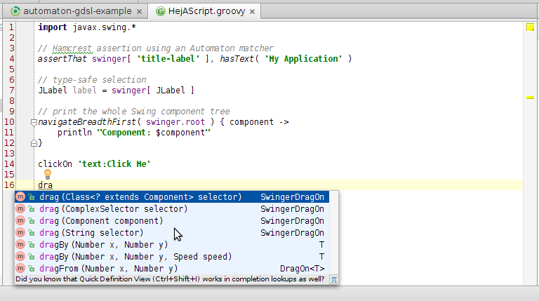

# Running Automaton Groovy scripts

The easiest way to use Automaton is by creating Automaton [Groovy](http://groovy.codehaus.org/) scripts (or AScript).

It is really simple and does not require any modification to your Java applications!

The following command shows how you would run your AScript, called `myAScript.groovy`,
to test an application `my-app.jar`:

```
java -javaagent:Automaton-1.x-all-deps.jar=myAScript.groovy -jar my-app.jar
```

You can also run several scripts in sequence by placing them all in the same directory.
For example, if you saved your scripts in a directory called `mydir`, you would run your scripts as follows:

```
java -javaagent:Automaton-1.x-all-deps.jar=mydir -jar my-app.jar
```

Automaton will only run the files with the `.groovy` extension under the given directory.
The scripts will be run in alphabetical order.

This mechanism to run scripts is currently limited to Swing application, but soon there will be support for JavaFX applications as well.

Script code can call all `Swinger` methods directly, such as in:

```groovy
clickOn 'text:A label'
```

An instance of `Swinger` called `swinger` is available for the script as well, so you can use it as in this example:

```groovy
import javax.swing.JLabel

JLabel firstLabel = swinger[ JLabel ]
```

You can also call any static methods from the following classes:

  * `org.junit.Assert`
  * `org.hamcrest.CoreMatchers`
  * `com.athaydes.automaton.assertion.AutomatonMatcher`
  * `com.athaydes.automaton.SwingUtil`

The following is a valid example of an AScript:

```groovy
doubleClickOn 'text:colors'
pause 500
clickOn 'text:yellow'

assertThat swinger[ 'status-label' ],
           hasText( 'You selected [colors, yellow]' )
```

AScripts are written in Groovy, so you can use the Groovy syntax as required:

```groovy
5.times { index ->
  clickOn "input-$index"
  moveBy( -100, 10 )
  if ( index < 4 )
    type "Hello $index"
}
```

## Code highlighting and assistance

You can write your AScripts with code-completion and highlighting with [IntelliJ IDEA](https://www.jetbrains.com/idea/).

To enable AScript support, all you have to do is add Automaton to your project's class-path. IntelliJ will then automatically
recognize any file whose name matches `*AScript.groovy` as being an Automaton script. For example:

 * LoginAScript.groovy
 * SomeTestAScript.groovy
 * AScript.groovy

Writing AScripts in IntelliJ is a pleasure:



Notice that you won't be able to run the script as you would run a normal Groovy script in IntelliJ.
